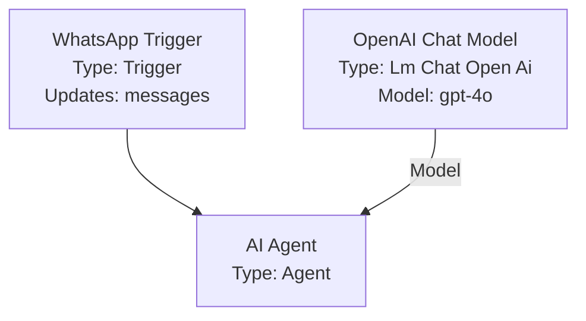

# n8n Flow Library

This repo now includes a production-ready Node.js toolchain that converts n8n workflow JSON files into Mermaid flowcharts, generates optional PNG previews, and publishes a searchable GitHub Pages catalog.

## What it does

- Converts a single n8n workflow JSON file into Mermaid `graph TD` syntax
- Extracts workflow nodes and connections
- Ignores sticky notes and UI-only nodes
- Preserves branching and labels branches when possible
- Styles triggers, AI nodes, vector stores, messaging nodes, logic nodes, HTTP nodes, and general action nodes
- Batch-builds a workflow catalog from the `n8n/` folder
- Optionally renders Mermaid PNG previews
- Generates `docs/` assets for GitHub Pages with search, tags, categories, and filters

## Project structure

```text
convert.js
package.json
scripts/
  build-library.js
src/
  parser/
    workflow-parser.js
  renderer/
    mermaid-renderer.js
  catalog/
    build-catalog.js
docs/
  index.html
  assets/
    app.js
    styles.css
  data/
  diagrams/
  previews/
  sources/
```

## Installation

```bash
npm install
```

This installs `@mermaid-js/mermaid-cli`, which is used for PNG preview generation.

## Usage

### Convert one workflow

```bash
node convert.js workflow.json
```

This writes `workflow-name.mmd` beside the input file.

You can also provide a custom output path:

```bash
node convert.js workflow.json ./output/my-workflow.mmd
```

### Batch convert the full `n8n/` library

```bash
npm run build:library
```

This generates:

- `docs/diagrams/**/*.mmd`
- `docs/data/workflows.json`
- `docs/data/summary.json`
- `docs/sources/**/*.json`

### Batch convert and auto-generate PNG previews

```bash
npm run build
```

This additionally renders:

- `docs/previews/**/*.png`

## Example Mermaid output



## GitHub Pages UI

The generated `docs/` site includes:

- Workflow preview cards
- Category filters
- Search by workflow name, summary, or tags
- Searchable tags derived from workflow tags, categories, and node types
- Direct links to generated Mermaid diagrams and source JSON files

To publish it with GitHub Pages:

1. Push the repository to GitHub.
2. In repository settings, set GitHub Pages to deploy from the `docs/` folder on your default branch.
3. Run `npm run build` before pushing so the catalog JSON, Mermaid files, and PNG previews are present.

## Notes

- Raw workflow JSON files under `n8n/` are ignored by `.gitignore` in this setup, as requested.
- Mermaid IDs are sanitized and deduplicated automatically.
- Branch labels are inferred for switch, if, and AI-specific connection ports when the workflow structure exposes that information.
- Node positions are intentionally ignored.
- Invalid or non-workflow JSON files are skipped during batch builds and reported in `docs/data/workflows.json`.
